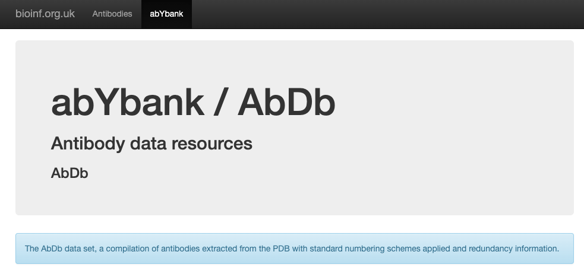

# Antibody CDR conformation classification 

Implementation of antibody CDR conformation classification method for [Conformational analysis of antibody CDR loops upon binding]()

Unbound CDR conformation clusters, both Canonical and affinity propagation (AP) clusters grouped as LRCs, in this publication are placed in [dirs/classifier](./dirs/classifier).
- Each classifier is a scikit-learn AP AffinityPropagation object, packed as `joblib` file, for details refer to scikit-learn documentation at [here](https://scikit-learn.org/stable/model_persistence.html)

A JSON file summarizing the LRC groups, Canonical clusters, and AP clusters is placed in [dirs/LRC_AP_cluster.json](./dirs/LRC_AP_cluster.json).

<!-- A snapshot of AbDb version `20220926` will be available on [Zenodo](https://zenodo.org/) upon publication.  -->
To obtain a snapshot of the AbDb version `20220926` used in this publication 
```sh 
# install gdown if not installed
$ pip install gdown
$ gdown https://drive.google.com/uc?id=1kAgSOjYBqb02IIEsc9yhJNiaoWRhpoaL -O AbDb_20220926.tar.gz
$ tar -zxf AbDb_20220926.tar.gz
```
- This will download a tarball of AbDb version `20220926` (size: 2.4G) and extract it to current folder `./abdb_newdata_20220926`, you can rename the folder to e.g. `AbDb` if you like.
- You can place this folder anywhere on your machine, but make sure to include a softlink to it in `./dirs` folder (see [Dependencies](#dependencies) for details)
## Requirements
```
- python == 3.9
- numpy==1.23.5
- pandas==2.0.3
- scipy==1.1.0
- scikit-learn==1.3.0
- PyYAML==6.0.1 
- joblib==1.3.1
- biopython==1.81
```
`clustal-omega` executable path, this is set default to `/usr/local/bin/clustalo` in `config/classify_general_abdb_entry.yaml`, change it to the correct path if necessary.

## Dependencies 
The script `classify_general_abdb_entry.py` (see [Usage](#usage)) for CDR conformation classification takes an AbDb antibody file as input, you can obtain AbDb from [abYbank](http://www.abybank.org/abdb/), the version used in the publication is `20220926`.

<a href="http://www.abybank.org/abdb">  </a>

After download AbDb, place it inside `./dirs` or simply create a softlink inside `./dirs` pointing to it, for example 
```
$ cd ./dirs
$ ln -s /path/to/ABDB ./ABDB
```

## Installation
```bash 
$ pip install git+https://github.com/biochunan/CDRConformationClassification.git
```

This will install a command line tool `cdrclu` for CDR conformation classification, see [Usage](#usage) for details.


## Usage

### From command line

```bash
$ cdrclu --cdr all \
    --outdir path/to/folder/output \
    --abdb path/to/folder/AbDb/ \
    1ikf_0P
```

### From source 

Create a python 3.9 environment and install dependencies
```bash 
# create an environment named cdrclass
$ conda create -n cdrclass python=3.9
$ conda activate cdrclass

# install dependencies
$ cd /path/to/CDRConformationClassification
$ pip install -e .  
```

Run classification on a single AbDb structure, for example `1ikf_0P`
```shell
$ python classify_general_abdb_entry.py \
    --cdr all \
    --outdir path/to/folder/output \
    --abdb path/to/folder/AbDb \
    1ikf_0P
```
Or use the command line tool `cdrclu` (see above)

This outputs a JSON file in `./results` directory, the file name is `1ikf_0P.json`, it has the following content: 

```JSON
[
    {
        "H1": {
            "closest_lrc": "H1-10-allT",
            "closest_AP_cluster_label": 35,
            "closest_AP_cluster_exemplar_id": "4z95_0",
            "closest_AP_cluster_size": 105,
            "closest_can_cluster_index": 1,
            "merged_AP_cluster_label": null,
            "merged_AP_cluster_exemplar_id": null,
            "merged_AP_cluster_size": null,
            "merged_can_cluster_index": null,
            "merge_with_closest_exemplar_torsional": true,
            "merge_with_any_exemplar_cartesian": null,
            "merged": true
        }
    },
]
```
Here, use CDR-H1 loop as an example, the classification results are stored in a list of dictionaries, each dictionary contains the classification results for a CDR loop.

- `closest_lrc`: the closest LRC group in torsional space 
- `closest_AP_cluster_label`: the closest AP cluster label, this is a unique integer assigned to each AP cluster within a LRC group
- `closest_AP_cluster_exemplar_id`: the closest AP cluster exemplar ID, this is the ID of the structure that is used as the exemplar for the AP cluster
- `closest_AP_cluster_size`: the size of the closest AP cluster, this is the number of structures in the AP cluster
- `closest_can_cluster_index`: the closest canonical cluster index, this is the index of the canonical cluster that the closest AP cluster belongs to, and this is a unique integer assigned to each canonical cluster within a LRC group
- `merged_AP_cluster_label`: the merged AP cluster label, this is a unique integer assigned to each AP cluster within a LRC group
- `merged_AP_cluster_exemplar_id`: the merged AP cluster exemplar ID, this is the ID of the structure that is used as the exemplar for the AP cluster
- `merged_AP_cluster_size`: the size of the merged AP cluster, this is the number of structures in the AP cluster
- `merged_can_cluster_index`: the merged canonical cluster index, this is the index of the canonical cluster that the merged AP cluster belongs to, and this is a unique integer assigned to each canonical cluster within a LRC group
- `merge_with_closest_exemplar_torsional`: True if the query CDR conformation is merged with the closest AP cluster measured in torsional space
- `merge_with_any_exemplar_cartesian`: 
  - `True` if the query CDR conformation is merged with an AP cluster measured in Cartesian space
  - `False` otherwise  
  - `null` if searching in Cartesian space was not carried out, i.e. the query CDR conformation is merged with the closest AP cluster measured in torsional space
- "merged": 
  - `True` if the query CDR conformation is merged with an AP cluster`, 
  - `False` otherwise

In this case, the query CDR-H1 loop conformation (CDR-H1 loop in `1ikf_0P`) is merged with the closest AP cluster in torsional space whose exemplar is the CDR-H1 loop in `6azk_0`. 

See the following gif for the visualization of CDR-H1 loop conformation of `1ikf_0P` (lightblue) superimposed onto the CDR-H1 loop of the closest AP cluster exemplar `6azk_0` (blue).


